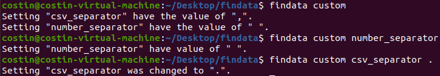
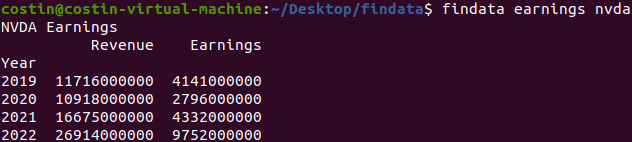
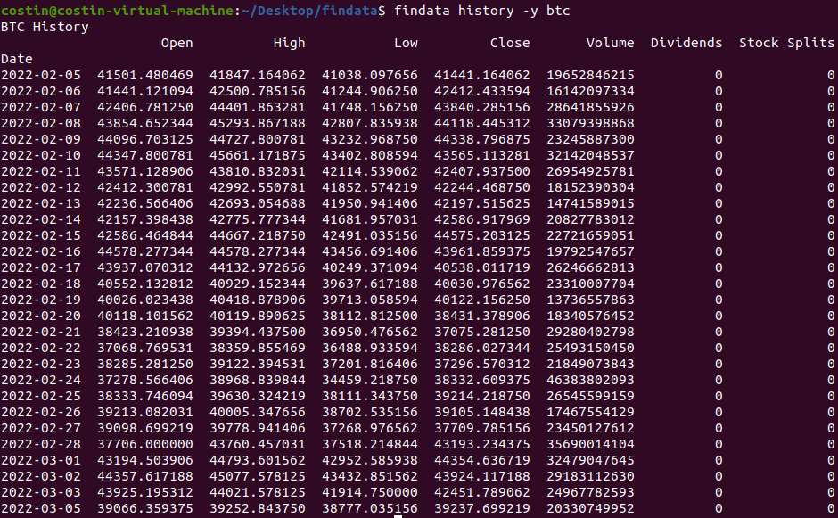
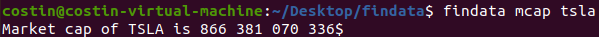
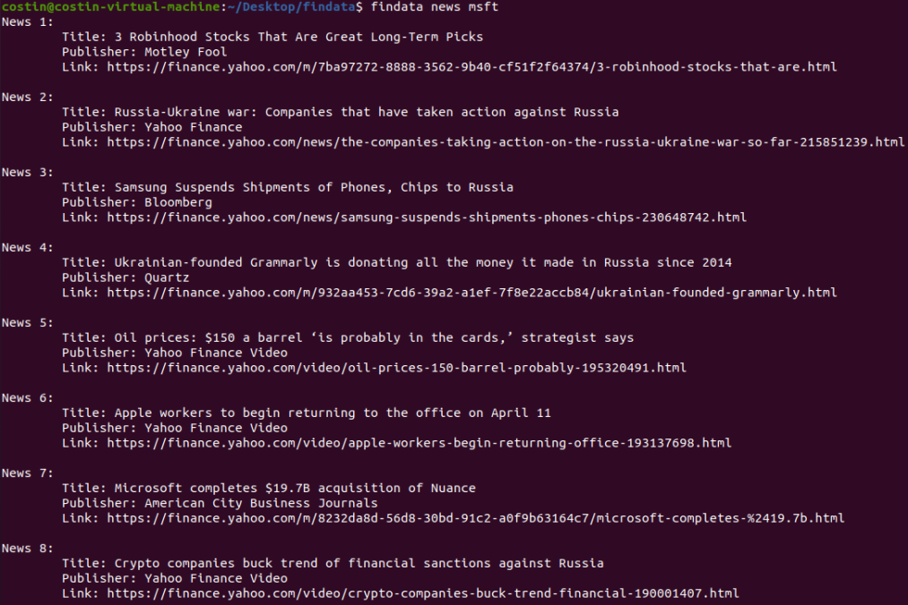
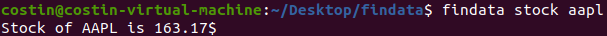
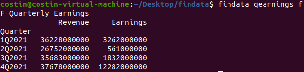
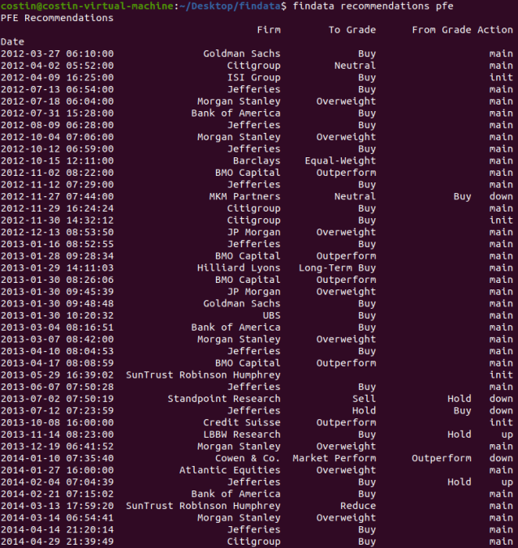
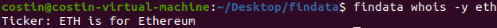

# findata

A simple CLI app that displays financial data using the yfinance library

## INSTALLATION

```
git clone https://github.com/CostyRo/findata
cd findata
chmod +x setup.sh
./setup.sh
```

To install that app, you need to clone this repo  
Change the directory to the app directory  
Give execution permission to the setup shell file, if the file doesn't have the permission  
And execute the setup file  

## THE FUTURE OF THIS APP

I am planning to extend this app and add more features  
And to make it more configurable  
You can also make another version of this app that suits better for you  
Just fork this repo and let you imagination to fly away  

###### ALL COMMANDS EXCEPT CUSTOM COMMAND REQUIRES A TICKER

## EXAMPLES

### CUSTOM

- Custom the varibles of the app



### EARNINGS

- Get the earnings of a company

-n option is for disable the printing of the data  
-p option is for plotting the data  
-s option is for saving the plot as a svg image  
-c option is for saving the data in a csv file  
-x option is for saving the data in a excel file  



### HISTORY

- Get the history of a company or a cryptocurrency

-y option is for enable the tickers for cryptocurrencies  
-n option is for disable the printing of the data  
-p option is for plotting the data  
-s option is for saving the plot as a svg image  
-c option is for saving the data in a csv file  
-x option is for saving the data in a excel file  



### MCAP

- Get the market cap of a company or a cryptocurrency

-y option is for enable the tickers for cryptocurrencies



### NEWS

- Get the financial news for the given word

-o option is for opening the news in the default browser




### STOCK

- Get the price of a stock or the price of a cryptocurrency

-y option is for enable the tickers for cryptocurrencies



### QEARNINGS

- Get the quarterly earnings of a company

-n option is for disable the printing of the data  
-p option is for plotting the data  
-s option is for saving the plot as a svg image  
-c option is for saving the data in a csv file  
-x option is for saving the data in a excel file  



### RECOMMENDATIONS

- Get the recommendations of a company or a cryptocurrency

-n option is for disable the printing of the data  
-c option is for saving the data in a csv file  
-x option is for saving the data in a excel file  



### WHOIS

- Identify the company or the cyptocurrency for a ticker

-y option is for enable the tickers for cryptocurrencies


